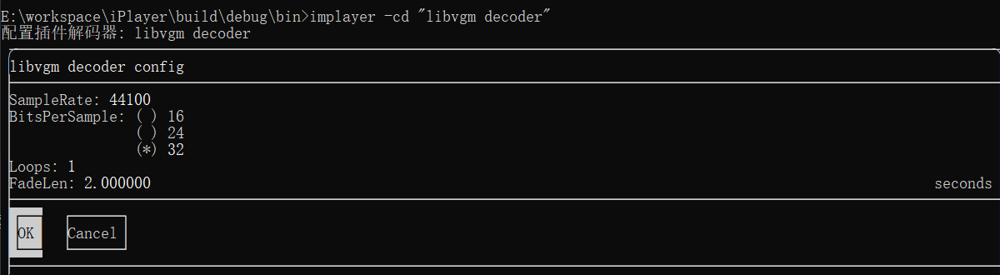

# imPlayer 开发日志 20260528


## 1 改名

​        有朋友告诉我苹果的平台上有一个 iPlayer，也是音乐播放类型的程序。感觉好尴尬，好在改名字并不麻烦，现在我们叫 imPlayer。改名字这个对应的任务是 todo_task_38，没什么难度，比自己查找替换方便多了。最主要的是，AI 考虑周到，test 测试项目中的代码和 .vscode\launch.json 中的启动配置都没忘了改。

## 2 libvgm_decoder 插件

​        libsnd_decoder 项目并不算全部完成，但是整个过程还是比较顺利的。这期就想着尽快增加一个播放游戏音乐的插件，就是这个 libvgm_decoder。因为使用的 libvgm 库不如 libsndfile 库那么有名气，所以生成的代码问题也比较多，第一个版本居然播放不出声音。可能是对这个库的学习不是很充分的缘故，我试了 GLM 5和 ChatGPT，如果仅仅是给出问题描述，AI 给出的代码很难一次就解决问题。甚至可以说，大部分情况都不能解决问题，所以这个插件花费了很多时间进行调试。

​        这也是目前 AI 生成代码的现状，我一直在一个矛盾状态中。每次 AI 生成结果之后，我都有一种想上手重构一下的冲动。我目前给这个项目的定位是尽量让 AI 生成代码，少人工修改，所以目前的策略是只要 AI 生成的代码能用就保留，只有在必要时再进行重构，并且也是引导 AI 自己生成重构代码。至于 BUG，我的策略是影响功能的 BUG 就立即修改，其他情况，只要不影响正常功能，就保留原汁原味的 BUG，这也是 AI 代码能力的真实反映。

​        经过一段时间调试，目前 libvgm_decoder 已经可以正常工作了，而且还支持 Config 接口（目前 libsnd_decoder 还不支持）。在这个过程中，有个有意思的事情。ChatGPT 最初生成的 ParseStreamFormatByLibvgm() 函数代码使用文件扩展名识别几种文件格式并不严谨，我让它修改一下，用解析文件格式的方式准确确定这几种文件。我原本以为它会打开文件，分析文件头或其他标识，结果，它居然偷懒，具体它是怎么做的，可以看看库中这个函数的代码。

## 3 ffmpeg_decoder 插件

​        这个必须得有，否则大量的媒体格式都不支持。这个任务对应描述是 todo_task_53，花费了 30多分钟才完成。从打印 log 看，ChatGPT 重试了两次，并且还产生一次编译错误，不过，最终完成了。不过它真实按照任务描述只支持了基本的几种格式，所以我不得不补充让它支持 dts，dsf 和 dff 等格式。最终的结果很惊艳，打开一个 dts 音频文件直接播放成功，看来还是 ffmpeg 库名气大，学习语料多，大模型都掌握的比较充分。相比之下，libvgm_decoder 就艰难很多，用了一天时间才弄出声音。

​        DTS 音频没有固定的比特率，所以每次运行都打印这个错误：

```
Estimating duration from bitrate, this may be inaccurate
```

我让 ChatGPT 解决这个问题，它的解决方案是：

```
- 处理运行时日志：Estimating duration from bitrate, this may be inaccurate  
  - 原因：FFmpeg 在某些文件缺少可靠时长信息时，会用码率估算时长并输出该 warning。  
  - 处理方式：在 ffmpeg_decoder 内增加 FFmpeg 日志回调过滤，只屏蔽这条已知提示，其它日志仍保留。  
  - 实现位置同样在 ffmpeg_decoder/FfmpegPlayCtrl.cpp（初始化时注册一次回调）。
```

有懂这个库的朋友吗，帮忙看看它是不是在忽悠我？

## 4 一堆解码器插件

​        有了  libsnd_decoder 和 libvgm_decoder 解码器插件项目的实例，添加其他解码器插件项目就非常顺利了。添加一个插件项目顺利的话半小时，不顺利的话加一天时间调试，总之，非常快。到目前为止，已经完成的外置解码器插件有：

```
ffmpeg_decoder - ape/flac/dts/dsf/dff... 众多已知媒体文件格式
gme_decoder - vgm/vgz,dro/dr2,ay,gbs/gym/hes/kss/nsf/sap/spc 文件格式
libflac_decoder - flac 文件格式
libogg_decoder - ogg 文件格式
libsnd_decoder - wav/w64/rf64/mp3/caf/pvf/flac/ogg/voc/raw/svx/sf/ircam/mat/xi/htk/sd2/mpc/avr/sph/wve/aiff 文件格式
libvgm_decoder - vgm/vgz,dro/dr2,sym,gym 文件格式
mpg123_decoder - mp1/mp2/mp3 文件格式
wavpack_decoder - wavpack 文件格式
```

mpg123_decoder 是将原来内置的 CMp3Decoder 内置解码器转成外置插件，只有 ffmpeg_decoder 花了点时间解决问题，其他插件项目几乎都是一次性成功。

## 5 配置和查看插件

​        既然已经支持外置插件解码器，就需要提供一个查看当前解码器信息的入口。这个任务描述在 todo_task_43 中，增加一个 -ld 参数。这个功能非常顺利，一次成功，这是输出情况：

```
E:\workspace\iPlayer\build\debug\bin>imPlayer.exe -ld
当前解码器列表:
- 名称: dr_wav Decoder, 类型: 内置
- 名称: FFmpeg decoder, 类型: 插件, 插件位置: E:\workspace\iPlayer\build\debug\bin\plugins\ffmpeg_decoder.ipdplus
- 名称: Game Music Emu decoder, 类型: 插件, 插件位置: E:\workspace\iPlayer\build\debug\bin\plugins\gme_decoder.ipdplus
- 名称: libFLAC decoder, 类型: 插件, 插件位置: E:\workspace\iPlayer\build\debug\bin\plugins\libflac_decoder.ipdplus
- 名称: libogg decoder, 类型: 插件, 插件位置: E:\workspace\iPlayer\build\debug\bin\plugins\libogg_decoder.ipdplus
- 名称: Libsndfile decoder, 类型: 插件, 插件位置: E:\workspace\iPlayer\build\debug\bin\plugins\libsnd_decoder.ipdplus
- 名称: Libvgm decoder, 类型: 插件, 插件位置: E:\workspace\iPlayer\build\debug\bin\plugins\libvgm_decoder.ipdplus
- 名称: Mpg123 decoder, 类型: 插件, 插件位置: E:\workspace\iPlayer\build\debug\bin\plugins\mpg123_decoder.ipdplus
- 名称: WavPack decoder, 类型: 插件, 插件位置: E:\workspace\iPlayer\build\debug\bin\plugins\wavpack_decoder.ipdplus
```

​        既然各个插件都已经支持 Config 接口了，那就也给插件配置提供一个入口。这个任务描述在 todo_task_44 中，增加一个 -cd 参数。这个功能也是非常顺利，这是配置情况：



​        最后说说编译，已经不少朋友提意见了，主要是折腾第三方库有点麻烦。因为项目代码变动太快，目前我还没心思考虑编译系统的整改，不过你有 Code Agent，可以让它帮你。当前的 cmake 体系对第三方的引用有两种方式，一种是使用 vcpkg 或其他包管理器安装好，然后让你的 Code Agent  修改相应的 cmake 文件，引用这些库。另一种是手工编译这些库，然后将库放 thirdparty 目录中，再然后让你的 Code Agent 生成 FindLibXXX.cmake 文件，最后在项目中使用这些 find 库辅助函数。目前 imPlayer 代码中两种方式都有，可自行参考相关文件，也可以根据自己系统中第三方库的安装情况调整它们。

​        当前这个版本启动时从 config/plugin.config 中加载插件信息，所以确保这个文件正常，否则只能播放 mp3 文件。一般正常编译，解码器插件都生成在 plugins 目录中，可使用 -rd 参数自动搜索插件，它会自动生成插件配置文件，所以，在第一次运行 imPlayer 之前，先用这个参数生成一下插件配置。


代码在这里：

https://github.com/inte2000/iPlayer


