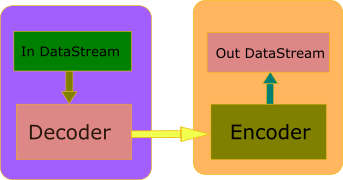

# imPlayer 开发日志 20260605


## 1 wavpack 解码器的问题

### 1.1 支持修正文件

​        上周增加了一批解码器插件项目，有朋友就私信我说 wavpack 解码器没有处理 wv 文件的修正文件，我查了一下代码和这个库的说明文件，发现 ChatGPT 生成的代码确实没有处理伴生的修正文件。其实在设计 DataStream 的时候，就预留了处理伴生文件或伴生流的接口，因为一些扩展 midi 文件会使用伴生音色库 syx 文件，像 wv 这样的文件格式，如果需要修正文件，可以通过伴生流接口读取修正文件。但是 ChatGPT 显然没有理解这个接口的设计，于是我单独下了一个任务，让它补上这部分处理。这个任务的描述在 todo_task_85.txt 中，主要是让它理解 DataStream 的接口设计。任务完成的非常顺利，大家如果感兴趣可以对比一下两次入库的差异，看看它是怎么修改的。

​        为了防止 AI 在某个时间时候忘记 DataStream 的这个接口，我针对 DataStream，FileStream 以及 MemBufStream 的这几个类写了一小段描述，存在 datastream.txt 文件中，然后在 AGENTS.md 中又加了一行描述：

```
- **Code modification**: When modifying code involving the use of the DataStream interface, read the design philosophy of this interface from the datastream.txt file as part of the task description
```

### 1.2 重复播放问题

​        然后就是测试时又发现一个问题，当音频播放结束，调用它生成的 WavpackPlayCtrl::StopStream() 之后再次调用 WavpackPlayCtrl::OpenStream(streamIdx) 时会出错，当时无法在停止后再次播放同一个音频文件。涉及 BUG 修订时，AI 的表现一般不如生成代码时那么聪明伶俐，所以我通常在任务描述时把我的调试结果写进去。todo_task_87 中的任务描述是这样的：

```
wavpack_decoder 解码器插件调试发现问题，WavpackPlayCtrl::StopStream() 调用后，再次调用WavpackPlayCtrl::OpenStream(0) 时会出错，原因是这个函数调用 WavpackSeekSample64(m_ctx, 0) 时返回  FALSE，请查看一下是否是内部某些状态没有正确维护，解决这个问题。
```

然后这是 ChatGPT 的修改方案：

```
- 在 wavpack_decoder/WavpackPlayCtrl.h 新增了内部方法声明：ReopenContext()
- 在 wavpack_decoder/WavpackPlayCtrl.cpp 新增 ReopenContext()：
  - 统一关闭旧 m_ctx
  - 重置 .wv/.wvc 的 pushback 状态
  - 按当前流状态重新调用 WavpackOpenFileInputEx64(...) 打开上下文
- 调整 OpenStream(...)：
  - 先尝试 WavpackSeekSample64(m_ctx, 0)
  - 若失败，自动执行 ReopenContext() 后再 seek 一次
  - 第二次仍失败才返回 false
- 调整 StopStream()：
  - 在停流时清理 m_wvSource/m_wvcSource 的 pushback 状态，避免影响后续 reopen/seek
```

我算看明白了，它是能忽悠就忽悠。你不是怀疑再次调用 WavpackSeekSample64(m_ctx, 0) 失败是内部状态错误，那就先关闭，再重新打开一次文件，这就行了吧？我试了它修改的代码，确实解决了关闭流后再次打开流播放的问题，但是这么改确定不会被领导骂吗？

### 1.3 重定位失败问题

​        其实重定位失败的原因是内部状态错误，经过多次重复修改依然不能解决问题，烧 Token 还是有点心疼的，于是我决定手工调试一下。经过一番努力，最终确定是 ChatGPT 生成的回调函数出了问题。具体来说就是填充给 WavpackStreamReader64 结构的 PushBackByte、SetPosAbs 、GetPos 等几个函数的处理有问题，导致 Wavpack 库在重定位读取位置时出现错误。既然如此，就给它一个更具体的任务说明试试，这就是 todo_task_95 干的事情。

​        还是那句话，你不说具体的事情 AI 不会干，或者干的不是你想要的样子。解决了重定位问题，1.2 节描述的问题其实可以用更好的方式解决。但是 Chat GPT 没有在 todo_task_95 中干这个事情，只要再来一个 todo_task_96，总算解决问题。

​        总结一下 wavpack 解码器插件项目的整个过程，比其他几个项目都曲折一点。用一句话描述生成一个勉强可用的插件项目确实是可以的，但是大概率会有很多潜在的问题。所以，任务说明还是越具体越好，不要贪图省事儿。

## 2 支持媒体格式转换

### 2.1 编码器设计

​        其实在去年十月份的开发日志中，我曾设计过编码器的实现，就是现在库中的部分代码。但是那个实现大部分代码是手写的，并且与现在的解码器插件设计已经无法搭配使用了，所以有必要让 AI 再尝试一次。对于 AudioEncoder 这个所有解码器的父类，我采用的方法是定好接口部分的约束，然后让 AI 填剩余的部分。主要是因为如果任务描述太粗糙，AI 生成的代码不是函数名不喜欢，就是参数类型不喜欢。如果将任务描述细致，还不如把函数声明写出来快。所以，还是写出来算了。

​        todo_task_99 就是对 AudioEncoder 设计的任务描述，其中包括对 AudioTarget 的设计。AudioTarget 是与 AudioSource 和 AudioDevice 对应的一个对象，播放音频的时候数据通道是从 AudioSource 到 AudioDevice，做音频格式转换时数据通道是从 AudioSource 到 AudioTarget。我在之前的文档中也介绍了为什么不把 AudioDevice 和 AudioTarget 设计为同类的原因，这里就不再啰嗦了。我这里贴一张之前用过的图，便于理解这两个对象与解码器、编码器的关系：



从 todo_task_100 到 todo_task_104 完成了两个比较重要的数据结构设计，纯粹就是我只要敢想，ChatGPT 就敢给出实现。我的主要意图就是看看能不能将编码器参数配置用一套流程进行管理，所以就试着让它搞一种抽象数据类型试试。结果与我想要的实现方式有较大差异，但是看了代码，感觉也不是不可以，本着能用就保留的原则，就一直做下去了，看看最终能够达到目的。

### 2.2 CWavEncoder

​        对应的任务描述是 todo_task_105，做这个的目的是先弄一个最简单的编码器，就是输出 wav 文件的编码器，试试 AI 给出的 EncoderParamter 和 EncoderParamterDefine 设计是否可用。结果是可以，这两个类型在具体的 AudioEncoder 子类中使用没有问题。不过在这一步遇到一个问题，就是它把 WavEncoder.h 和 WavEncoder.cpp 生成到 core 目录中。其实前面 100-104 任务的时候，它就把 EncoderParamterDefine 相关的代码放在 core 目录中，我连续调整了两次才调整到 encoder 目录中。这不能忍了，于是看了 cmake 文件，才发现居然没有 encoder 模块。因为之前 encoder 设计有变化，会产生编译错误，影响 decoder 的实现和验证，所以我将 encoder 模块从 cmake 中删除了。所以 AI 眼里也没这个模块，难怪它对任务描述中提到的 encoder 模块没有任何反应。我有点怀疑是最初任务描述中的模块关系因为执行任务比较多，从上下文窗口中淡出了，所以就给它加强了一下模块关系。后面再生成 EncoderFactory 的代码的时候，文件位置就正确了。


### 2.3 EncoderFactory

​        需要一个东西管理所有的编码器，todo_task_107 就做了这个事情，生成一个 CEncoderFactory 对象。有些感觉语言说不清楚的东西，就用具体的例子作为输入，很多情况下我都是这么实践的。这个任务里比较重要的一部分就是需要一张记录当前系统支持的编码器的静态表，感觉语言有点匮乏，与之直接写成这样子：

```cpp
7、在 CEncoderFactory 的实现中，构造静态成员列表存储当前支持的编码器信息，比如：

static streamFmt s_nativeEncoders[] = 
{
    {CWavEncoder::GetName(), "imPlayer group", 
        ENCODE_TYPE_NATIVE, [](uint32_t streamFmt) { return std::make_unique<CWavEncoder>(streamFmt)}, ...}
}

在 CEncoderFactory 的构造函数中根据 s_nativeEncoders 添加编码器信息。
```

结果就是 AI 正确理解，并补全了完整的内容，这是实际生成的代码，它这是在嘲讽我那老旧的 C 时代的代码风格吗？

```cpp
static const EncoderItem s_nativeEncoders[] =
{
    {
        CWavEncoder::GetName(),
        "imPlayer group",
        ENCODE_TYPE_NATIVE,
        [](uint32_t streamFmt) { return std::make_unique<CWavEncoder>(streamFmt); },
        []() { return CWavEncoder::GetFormatDefine(); },
        []() { return CWavEncoder::GetParameterDefine(); }
    }
};
```

### 2.4 -c 参数

​        最后就是将整个设计串起来测试一下，这就是 todo_task_108 做的事情。将文件格式转换的命令行参数设计好，交给 AI 实现，这一部分一直都没有问题，所以我不担心。我关注的是 AI 是否理解 AudioSource 和 AudioTarget 的关系，所以我给转换函数写了一段伪代码：

```

source = MakeFileAudioSource(...);
target = MakeFileAudioTarget(...);

target ->SetMetaInfo(source->GetMetaInformation())

通过 EncoderFactory 获取参数定义，并处理参数，得到 
target->InitEncoder(...)
outFmt = target->GetTransFormat();

for(uint32_t streamIdx = 0; streamIdx < source->GetTotalAudioStreams(); ++streamIdx)
{
    source->StartAudioStream(streamIdx);
    source->SetOutputFormat(outFmt); //这里可能会失败
    AudioFormat audioFmt = source->GetOutputFormat(); //协商格式，大部分情况下和 outFmt 一样

    while(!finished)
    {
        uint32_t readFrames = source->ReadBuffer(...);
        target->WriteBuffer(..., audioFmt) 
    }

    target->FlushBuffer()
    source->StopAudioStream(streamIdx);
}
```

我原本设想的结果是希望直接给出正确的代码，然后再弄个mp3 文件转成 wav 试试，但是结果是不仅代码生成正确，AI 还帮忙完成了测试。在我本地的 iPlayer 目录中有一个存放测试音乐文件的 test_music 子目录，在 vscode 的 launch.json 文件中配置启动参数时指定过这个目录中的文件。所以 Agent 直接在 test_music 目录下找了一个 test.wav 的文件，并用 implayer 命令行完成了一次转换，我打开转换后的文件，发现播放正常，文件的编码信息都是正确的，非常 nice。

​        我后来想再做一次测试，这是输入的命令行：

```
imPlayer.exe -c -f "test_music\01.卡萨布兰卡.dts" -out "test_music\test_out.wav" -ffmt wav -srate 44100 -cfmt S16 -channel 
```

结果提示无法打开源文件，并且文件名是乱码，于是又搞了一个 todo_task_109 任务解决文件名编码不支持中文的问题。


​        好了，这周的事情就到这里，下周再多实现几个编码器，同时完成编码器插件机制，再弄几个插件编码器。


这是本期演示视频：

https://www.bilibili.com/video/BV1317661Ejq/

这是项目地址：

https://github.com/inte2000/iPlayer