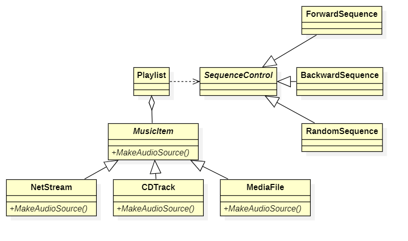
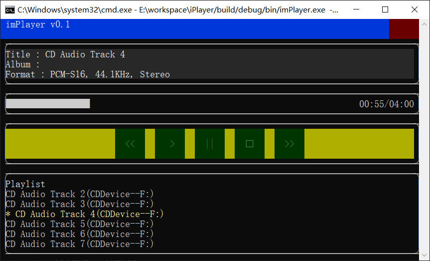

# 开发日志20260904


​        在之前的技术随笔中，我提到过对音乐条目的抽象设计。简单说就是所有可播放的源都被称为音乐条目（MusicItem），一个 mp3 音频文件是一个条目，一个网络码流的端口是一个条目，CD 上的一条音轨也是一个音乐条目。这样设计的目的是后期音乐库的管理就打破了 CD、Cue 列表之类的容器限制，全部统一为可播放音乐条目。用户从音乐库中抽取一个播放列表，可能包含几个音乐文件以及分布在几张 CD 上的几条音轨。这一期做的事情就是将这个设计初步落实一下。

## 1 音乐条目

​        上一期增加了一系列解码器插件，当准备增加 CD 解码器的时候发现，缺少展示 CD 上的多条音轨的方法，所以就准备先做播放列表。如果将 CD 音轨也视为播放条目，那么一张 CD 就可以表达为一个播放列表，即全是 CD 音轨组成的播放列表。这样一来，后续的各种 CD 解码器和 Cue 文件的处理，就有了基础。

​        自从在 git 上公开了代码，就不停有人问我，为什么不把 AudioSource 也设计成抽象对象，应对不同的音频源？其实是我把这个地方的抽象设计在音乐条目上了，我希望它们进入解码器后就不要再关心是那种类型的音频源，按照指定的格式解码就行了。大家关心的是当前系统中有个 MakeFileAudioSource() 函数，到时候这个地方会不会一大串 if-else？答案是不会，因为后续的 MakeAudioSource() 是每个 MusicItem 的职责。这是之前设想阶段画的一张图，大家一看就会明白。



## 2 落地过程

### 2.1 MusicItem

​        首先我需要一个 MusicInfo 的数据结构作为各种 MusicItem 的存储载体，方便存入播放列表的持久化文件，或者音乐库。我给 ChatGPT 下了个任务，让它帮我定义这个 MusicInfo，这是 todo_task_113-114 做的事情。ChatGPT 给出了一些属性，我又手工补充了几个，然后就是完成 MusicItem 抽象对象和各种具体音乐条目对象的实现。

### 2.2 Music 和 PlayList 对象

Music 表示一个抽象音乐条目，它存在的作用就是将对音乐条目的操作抽象化，让 FileMusic，CDTrackMusic，CueTrackMusic 这样的实现表达具体操作的差异化。PlayList 是 Music 的聚合体，同时借助于 CPlaySequence 实现播放列表的遍历策略。将处理列表遍历的代码从 PlayList 中抽取出来是很有必要的，接口隔离的设计使 PlayList 摆脱繁琐的索引计算方法，后续增加新的遍历方法，比如随机顺序播放，只需增加一个 Sequence 策略即可，不需要对 PlayList 对象大动干戈。这个任务的描述在 todo_task 115 中。todo_task 116 增加了播放列表文件的加载和保存功能，配合 ml 参数可遍历一个目录生成播放列表。

### 2.3 界面变化

命令行增加一个 playlist 参数，配合 -p 参数可以播放一个列表，配合 -ml 参数可以生成一个列表。TUI 界面的变化就是在那一排播放控制按钮的下边增加了一个音乐文件列表，播放音乐列表时可以看到列表中的所有音乐，正在播放的那个条目会加亮显示。

## 3 音乐 CD

说来说去，目前还是只有一个 FileMusic，PlayList 的设计能够真的支持各种音乐条目混合编组，还是要再增加一种 Music 对象才能证明这套东西能玩得转。所以我将 CDTrackMusic 和 CueTrackMusic 的支持排在编码器插件化设计之前。这一期先实现 CDTrackMusic。

### 3.1 重新设计 DataStream

其实，早就想对 DataStream 动手了。那个名为 StreamControl 的东西当初时考虑到解码器会根据参数反向影响数据流的读取方式，但是实际上没啥鸟用，拿掉应该没影响。还有一个 GetMetaInformation，这货的作用是想着某些媒体的元信息，比如 tag 之类的，不能通过解码数据流获取，所以留了这么一手。很显然，之前的权宜之计违反了 ISP 原则，但是一直拖着没动手。

为什么现在要对 DataStream 动手？之前设计 Read 接口方法的时候，将类似光盘这样的按照扇区读取的流，映射为 Block x Count，一次性整体读取。但是最近研究了 Audio CD、DTS CD 和 Super Audio CD 的解码库，发现这些库的设计都是基于具体扇区的访问，通常是以起始扇区号，或起始扇区+扇区数作为读取参数，这就和 DataStream::Read 的设计格格不入了，尤其是有的库要求返回读取的扇区数，这就不得不把 DataStream::Read 的返回值拿来再计算一下，用着非常别扭。所以，是时候对 DataStream 动手了。

我的重构思路是这样的，将 GetMetaInformation 拆出来，放在一个独立的 MetaSource 接口中，同时再增加一个 SectorSource 接口，用于扇区访问：

```
enum class SectorSourceType { AudioCD，DTS_CD，SACD，AudioDVD };

struct SectorSource
{
    SectorSourceType Type() const = 0;
    uint32_t ReadSectors(uint64_t startNo, uint32_t count, void *buf) const = 0;
    uint32_t SectorSize() const = 0;
    uint32_t SeekToSector(uint64_t sectorNo) = 0
};
```

最后，就是给 DataStream 添加一个 QuerySource()，查询当前 DataStream 是否支持相关的 Source 接口。这有点像 COM 了，不过没有那么复杂的引用计数机制。

### 3.2 CDSectorsStream 和 CDSectorsDecoder

有了接口隔离的设计，CDSectorsStream 就简单很多了，它同时需要同时支持 MetaSource 和 SectorSource，但是也不影响它作为一个一般的 DataStream 使用。采用多接口继承方式：

```
class CDSectorsStream : public DataStream, 
                       public MetaSource,
                       public SectorSource;
```

当 CDSectorsStream 配合 CDDecoder 之类的以扇区方式访问的解码器使用时，CDDecoder 会 Query 它是否支持扇区访问接口，如果支持，就采用扇区接口读取数据，如果不支持，就退化为使用 DataStream 接口，以 PCM 编码采样为单位，按照多扇区整体读取方式使用。当 CDSectorStream 配合 WavDecoder 这样的解码器，直接使用 DataStream 接口，以 PCM 编码采样为单位，按照多扇区整体读取方式也没有问题。


CDDecoder 的实现就简单了，它只管从 CDSectorsStream 读取数据，并按照 SectorSourceType 的类型进行解码。CDSectorsStream 可以是物理光驱（或者虚拟光驱）上挂接的 CD 光盘，也可以是磁盘上的 CD 映像文件，CDDecoder 对此无感。

当 SectorSourceType 是 DTS_CD 或 SACD 时，CDDecoder 会动用相应的解码器，初步考虑是使用 ffmpeg 的 libavcodec 解码库，具体实现的话，走到这一步再说，先把普通的 AudioCD 解码实现了。根据一般性原则，CDDecoder 通过 MetaSource 获取 Stream 的编码格式，不应该写死为 16比特，44100 采样的 PCM 音频数据格式。

### 3.3 实现 cd_decoder 插件

这一期的实现过程从 todo_task 113 开始，到 todo_task 140 结束，接受朋友们的建议，每个 task 做完就提交到 git 一次，这样可以用 gitdiff 直观感受 AI 针对这个 task 的修改内容。另外，从 todo_task 117 开始，我把 opencode 最后给出的任务总结也附加到 todo task 文件中，方便对照。下图是 todo task 140 完成后，imPlayer 播放 CD 的情况：



## 4 其他

首先说说花了多少钱，有好几个朋友一直在问。其实没多少，这个测试项目到现在总共花费大概 200 多刀，原因主要有几个，首先我选了便宜的大模型，gpt-5.3-codex 百万输入只要 1.75 刀，输出大概是 17.5 刀（或者是 23 刀，记不清楚了），很实惠。其次是我把任务拆分的很细，任务描述尽量具体，甚至给出代码例子让大模型参数。我觉得前些年流行的提示词工程的某些实践在 AI Agent 的时代依然适用，让大模型一次就理解问题是解决问题的高效方式。最后就是调试 bug，这是我觉得大模型比较弱的地方，所以我每次都把问题说的很细，甚至具体到某段代码的修改，必要时手工调试，将问题定位到比较小的范围内，然后再给 AI 下任务。总的来说，每个 task 的执行消耗在 1-2 刀之间。

讲个笑话，项目经理问团队 leader，为什么你们的程序员在月初的时候聪明伶俐，到月底的时候就像是一个笨蛋？leader 回答：因为月底的时候 token 都烧完了。我觉得用 AI 写代码是一个典型的“将帅无能，累死三军”的事情，无脑地烧 token 不值得炫耀。同样，我也不认为不使用 Claude 它们家的东西就不能工作，这个测试项目的 Code Agent 用的是 codex 和 opencode，目前主要是用 opencode，配合 gpt-5.3-codex 够用了。

最后，代码都是 AI 直出的，我会审查，但是只要问题不大，不影响基本功能，我就接受，保持 AI 代码的原始味道。当然，代码结构实在辣眼睛的时候，我也会下一些调整的任务。比如 todo task 135，我就要求 CD 解码器增加一个 DataBuffer 作为解码缓冲区，AI 完成后我觉得不满意，又在 todo task 136 中让它继续调整。对 AI 生成的 CDataBuffer 的具体实现，我没有做任何修改，因为测试一次就跑通了。


最后，imPlayer 代码库在这里：

https://github.com/inte2000/imPlayer


