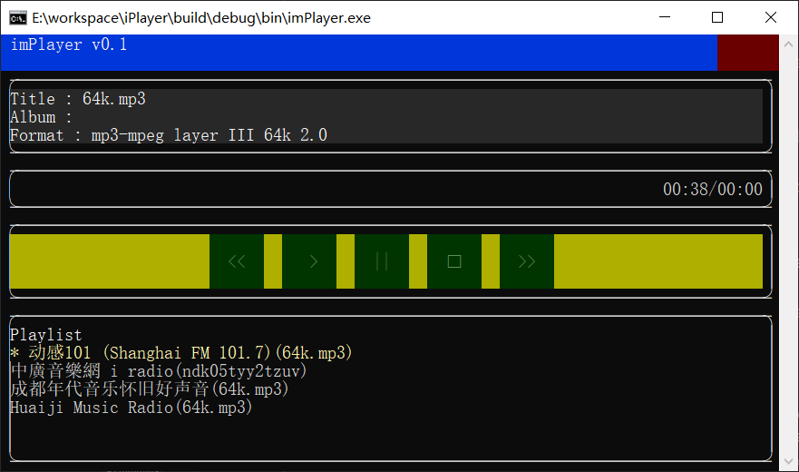
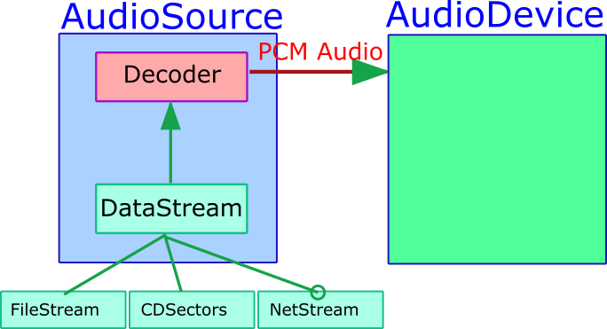
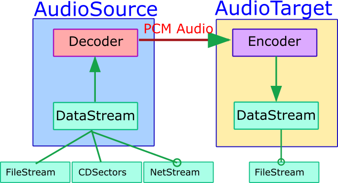

# 开发日志20260916

​        上一期通过 CD 音轨播放验证了“抽象数据流+抽象解码器”设计对非文件流的可行性，后续可以在此基础上进一步支持 DTS-CD 和 SACD。这一期先不急着做这个事情，先把另一种抽象数据流搞定，那就是网络流媒体。

## 1 CNetStream

​        首先，流媒体的传输协议有很多，比如 HTTP/HTTPS、RTSP、RTMP、UDP 等等，这一期先简单支持 HTTP/HTTPS 协议。至于媒体格式，有 MP3、MP4、MPEG-TS、FLV、HLS 等等，计划采用 FFMPEG 库，一网打尽（libVLC 也可以）。

​        为了简化解码器的设计，我们让 DataStream 承载这些传输协议的复杂性。NetStream 肯定要应付网络数据传输的不稳定性。所以我设计了一个单任务读和单任务写的 RingBuffer，配合一个独立的网络传输线程，实现一个带缓冲的 DataStream 对象。我想的起始挺简单的，但是实现起来比我预计的曲折，从任务 141 一直折腾到 148 才算弄出声音。想看这个过程的可以看看从 todo_task_141.txt 到 todo_task_148.txt 的提示，以及对应的入库记录，看看我都干了啥，还有 ChatGPT 是怎么忽悠我的。

​        为了让解码器能一致地处理所有的流，设计上将没有固定长度的网路流伪装成长度非常长的固定长度流，支持 Tell，但是不支持 Seek，目前也只支持读，不支持写。虽然设计的长度是一个非常大的数字（估计可以播放几十年），但是只要网络不断，Read 函数总有读完的那天。不过问题不大，到时候播放会自动停止，如果播放列表中还有下一曲，则跳到下一曲。


## 2 解码器

​        为了先把过程跑通，我选了几个都是 mp3 编码的广播流，比如上海的“动感 101”。因为确定是 MP3 流，所以 MakeNetStreamAudioSource 就写死了用 StreamFormatMp3 格式创建解码器对象：

```cpp
std::unique_ptr<CAudioSource> MakeNetStreamAudioSource(const std::wstring& url)
{
    const bool isHttp = IsPrefixNoCase(url, L"http://");
    const bool isHttps = IsPrefixNoCase(url, L"https://");
    if (!isHttp && !isHttps) {
        throw std::runtime_error("only support http stream");
    }

    std::unique_ptr<CDataStream> streamPtr = MakeNetStream(url, NetStreamType::Http);
    if (!streamPtr) {
        throw MakeRuntimeError("Fail to open net stream: ", url);
    }

    CDecoderFactory& factory = CDecoderFactory::GetInstance();
    std::unique_ptr<CAudioDecoder> decoderPtr = factory.MakeAudioDecoder(StreamFormatMp3);
    if (!decoderPtr) {
        throw std::runtime_error("Fail to generate decoder for net stream");
    }

    return std::make_unique<CAudioSource>(std::move(streamPtr), std::move(decoderPtr), StreamFormatMp3);
}
```

不过问题来了，居然报解码格式错误。查了一下原因，原来插件配置中 mpg132 解码器插件排在 ffmpeg 解码器插件前面，所以查找 mp3 格式的解码器时优先找到 mpg132 解码器。mpg132 解码器内部要求流支持 seek，我们的 NetStream 被设计为不支持 seek，所以解码器报错。

​        为了解决这个问题，我编辑了一下 plugin.config 文件，将 ffmpeg 解码器插件调整到最前面，让 CDecoderFactory 优先使用 ffmpeg 解码器插件解码 MP3 格式。ffmpeg 支持线性流式解码，不需要 seek 支持，所以就没有问题，网络广播也能正常播放了，这是播放网络广播列表的情况：



​        到目前为止，整个方案设计中的关键环节都已经验证可行，包括抽象数据流、解码器、解码器插件、编码器，抽象数据流也验证了文件流、CD 音轨扇区流和网络流与解码器和编码器的配合，整个架构方案是可行的。在这个架构下，媒体播放是这样的对象关系：



文件格式转换是这样的对象关系：



文件格式转换这个结构，同样可用于将网络广播流保存为文件，当然，如果 CNetStream 的 Write 接口方法实现以后，这个结构还可以做局域网音乐广播。


## 3 NetRadio 解码器插件

​        尽管到现在为止，我们确实可以用 ffmpeg 解码器插件配合 CNetStream 播放网络广播，但是也存在一些问题。大家看上一节的播放器界面也能看到，显示的 Title 有点不正常。原因在于播放音乐文件时，元信息有固定的存储位置和格式，FileStream 配合解码器解析很容易处理。但是对于网络广播，有一个特殊的 SHOUTcast/Icecast 元数据协议（ICY协议），这个协议允许在音频数据中穿插实时的文本信息，比如当前节目名称。如果坚持抽象数据流配合通用解码器的原则，那么每个解码器都需要在 QueryMetaInfo 的时候针对 NetStream 做特殊的处理，这就有点烦人了。

​        所以我的想法是就像处理 CD 音轨一样，用一个专用的解码器处理网络广播的解码，其底层的承载仍然是 ffmpeg，但是可以对各种网络广播协议进行特殊处理。作为 AudioSource 的一种，这样做依然可以适配到上面的两种结构中。所以接下来就是仿照 ffmpeg 解码器插件，实现一个NetRadio 解码器插件，然后对元数据做特殊处理。任务 149-150 完成了 radio_decoder 插件，“顺利”的原因是偷了个懒，直接从 ffmpeg_decoder 插件项目复制了一份。暂时先这样，主要是先完成对网络广播的支持，未来可能不使用 ffmpeg，改用 libVLC，这也是我朋友的建议。

​        到目前为止，第一次随笔的设计目标都已经达成，统一的播放列表，自适应的音乐条目类型，统一的播放和格式转换模式。从音频起点到终点之间尽量少做格式转换，这个目标也初步达成，通过 AudioSource 和 Device，以及 AudioSource 和 AudioTarget 之间的协商步骤，确保格式转换一站式完成。接下来要做的就是音效 Filter 的实现，音效器位于 AudioSource 和 AudioTarget 之间，具体怎么做还要细化一下。


