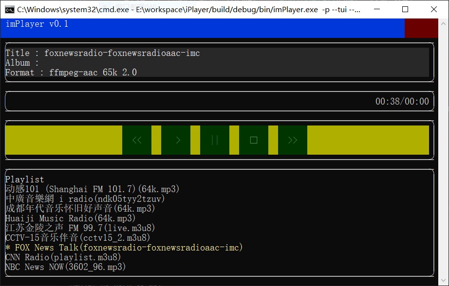
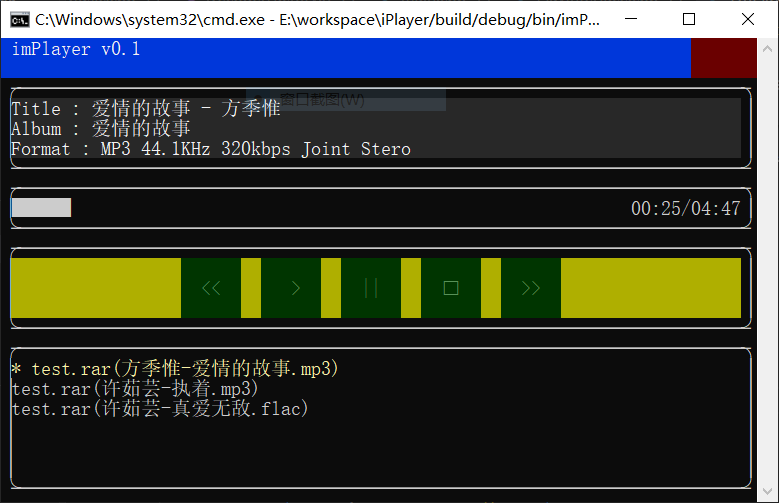

# 开发日志20261009


## 1 回答问题

​        先回答一个朋友们问的比较多的问题。一直有朋友问，你的这套设计要求音频源都封装为 Datastream 接口，如果遇到就是不支持流接口的音频格式库，你当如何应对？就目前用到的几个音频解码库来说，都支持非文件方式的数据操作接口，所以没什么问题。如果真遇到只支持文件接口的解码库，我最初是设想对解码库进行深度魔改，绕过它的文件接口，直接用底层的数据解码接口重组一套流式数据接口。但是，这么也太消耗精力，并且对库的侵入性太强，库的作者可能会反对。另外，我也考察了几个这样的库，发现一个普遍的问题，就是库的文件接口层和内部解码层的职责并不清晰，依赖关系错乱，想做一套与文件接口并行的流式接口就需要对库做深度重构，这可不是我想干的事情，我只想用用而已。于是我就采用了变通的办法，那就是设计一个 DummyStream，这个 DummyStream 不做任何事情，就是把它代表的流的名字传递给 Decoder，Decoder 拿着这个名字直接调用库的文件接口即可。

​        其实这个思路一直在设想中，并没有实施。上一期用 NetStream 支持网络广播的时候，我就发现一个比较棘手的问题，那就是 NetStream 要应对各种网络流的传输协议，会导致巨大的工作量。HTTP 协议还算简单的，有些复杂的传输协议甚至和编、解码行为混在一起，处理起来非常麻烦。于是我就想到了这个 DummyStream 的想法，如果将网络流的 url 直接透传给 Decoder 使用的 ffmpeg 库，就可以省去这么多麻烦，同时还验证一下用 DummyStream 应对某些解码库的思路是否可行。

​        任务 151 - 153 就做了这个事情，为了简单化，我让 AI 直接从 radio_decoder 项目复制了一个 radio_decoder2 项目，然后让 AI 按照打开 url 的方式调用 avformat_open_input 函数。我也修改了 plugin.config，对网络音频默认就使用 radio_decoder2 插件配合 CDummyNameStream 播放。好处就是充分利用 ffmpeg 库对网络流协议的支持，可以播放几乎所有类型的网络广播和网络视频中的音频部分，所以我给 net_radio.playlist 增加了几个广播电台，有支持 RTSP/RTMP 协议的，有使用 AAC 编码的，有使用 mpeg-ts 编码的。我把这个列表也上传了，感兴趣的朋友可以试试添加新的 url。



## 2 支持压缩文件

​        到目前为止，文件、CD 光盘\光盘映像、网络流都支持了，还有一个需要面对的情况就是压缩包中的音频文件播放。如果将压缩包展开到临时目录，然后按照普通文件的处理流程进行播放，当然不需要额外的措施，现有的播放流程就能应对。但是这样的话不利于整体播放列表的处理，并且遇到大的压缩包文件，展开时间比较长。既然我们设计了 DataStream，那么弄一个支持压缩文件的 CZipFileStream 应该也不是什么难事儿。

​        最初考虑用 libarchive 库，因为它支持的压缩文件格式比较全，一个库就搞定了。我先用 Chat 界面问 GPT 关于这个库，结果沟通上出了问题，它告诉我这个库不支持随机读取，我误以为是这个库只能从头到尾将一个压缩包全部释放（印象中有个库是这么设计的）。所以经过一番拉扯，GPT 最终推荐我用 selmf/unarr 库。但是当所有工作都做完以后发现这个库问题挺多，不支持 RAR 5，这个基本上现在的 winrar 生成的压缩包基本上都打不开。另外，对文件名中的中文处理不佳。任务 159 和 166 两次跟这个库拉扯中文的问题，也没有解决问题，最后一次拉扯的结果我没有入库，因为 GPT 给出的解决方法是直接修改 selmf/unarr 库，在里面添加针对 WIN32 的代码，看着好像跟这个库的风格格格不入。我放弃了，直接回退代码，然后改用 libarchive 库，这就是任务 166 干的事情。

​        之所以最后换用 libarchive，是因为后来问了 deepseek，它说可以。于是我把 libarchive 的代码拉下来看了一眼，发现 GPT 说的不支持随机读取是因为 linarchive 库确实没有提供针对包内文件名的打开操作，它只能通过 archive_read_next_header 遍历所有的文件 entry。但是还是可以通过 archive_read_next_header 定位到具体的文件，然后读取文件。总之，在库的选择上浪费了不少时间，不过最终效果是可以接受的，支持 zip，rar，7z，xz，gz，bz2 等多种格式，非常 nice。

​         最终命名上没有使用 CZipFileStream，而是使用 CArchiveFileStream，着眼于今后可能会有不压缩的 tar 包，用 Zip 容易让人误会它的用途。这是测试时直接播放 rar 文件中的音乐文件的情况：



​        libarchive 处理压缩包确实不支持随机读写，但是我让 GPT 在 CArchiveFile 里设计了一个滑动窗口，用一种笨拙的方式让 CArchiveFile 支持随机读，从而让 CArchiveFileStream 也可以随机读取。从任务 154 到 168，中间过程十分曲折，还多次被 GPT 忽悠。比如当文件 title 中有空格或其他不可识别编码字符的时候，TUI 界面会抖动（闪烁），我让 GPT 解决这个问题，它竟然写了个函数这样替换空格：

```cpp
std::wstring MakeNonBreakingText(std::wstring value)
{
    for (wchar_t& ch : value)
    {
        if (ch == L' ') {
            ch = 0x00A0;
        }
    }

    return value;
}
```

这都把我气笑了。后来我懒得跟它废话了，直接手工删除了这段修改。

​        这期间还有一个事情比较有意思，我最初规划的两个对象的名字分别是 CArchive 和 CArchiveFile，其中 CArchive 被 GPT 放在一个名为 archive.h 的头文件中。当后来把库切换成 libarchive 的时候，它遇到了编译问题，就是本地 include 目录中的 archive.h 覆盖了库中的同名头文件，这导致 archive_read_new，archive_read_free 等一系列函数的声明找不到。从输出的 log 看，opencode 对这个问题纠结了很久，它最后的选择不是把本地的文件名改一下，而是新建了一个 LibarchiveApi.h 头文件，然后把需要引用的库函数在这个头文件中做了外部声明。不管怎么说，算是解决了编译问题，但是这个方法不知道是从哪个大聪明人类那里学来的，甚为新奇。更有意思的是，当我要求调整将这两个对象的设计，将 CArchive 改成 CArchivePackage 时，我强调了一下要根据类名调整文件名，GPT 居然自适应了这个修改，并自己删除了 LibarchiveApi.h 头文件。 

## 3 杂项

​        另外，近期收到 OpenAI  的通知邮件，说 GPT-5.3 codex 下线了，建议切换到 gpt-6-sol，并说了 gpt-6-sol 性能更好，价格更优惠等等。但是仔细一看，原来说的是 gpt-6-sol 相对于 gpt-5.6-sol 价格优惠，看了 benchlm.ai 上的评分，gpt-6-sol 在推理和知识方面比 gpt-5.6-sol 略好，但是在代码和生成方面还略弱于 gpt-5.6-sol。但是 gpt-5.6-sol 的价格相对于 GPT-5.3 codex 来说，翻了一倍都不止。我用大模型的感觉就是在能力相差不大的情况下，主要还是看 Agent 和任务提示是否合理，所以，我最终选择是用  gpt-5.4 处理简单任务，对抽象度比较高的任务用 gpt-5.6-sol 或者 gpt-6-sol。这样一来，平均下来每次任务执行如果开启 oh-my-opencode 的多 Agent，需要大约 3.5-8.5 刀，不使用多 Agent 的话，大概是 1.5-2.5 刀。比之前的费用有了显著的增加，就这样，先用一段时间看看再说吧。


